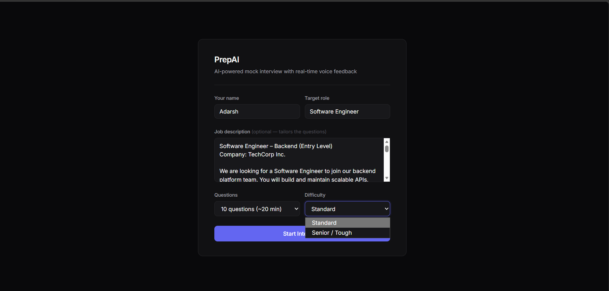
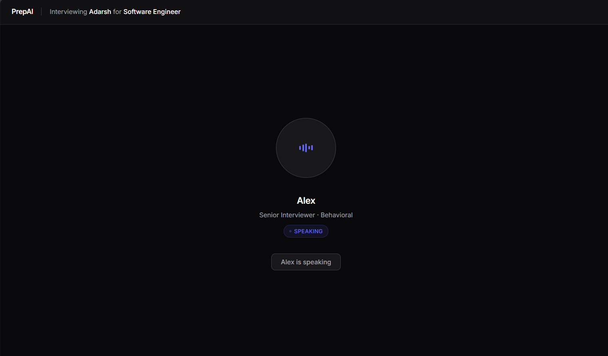

# PrepAI — AI Mock Interviewer

A real-time voice-based behavioral interview coach. Ask a question out loud, get spoken feedback, and receive a detailed scorecard at the end. Built on a low-latency async voice pipeline with barge-in support.

> **Stack:** Python · asyncio · faster-whisper · Piper TTS · Silero VAD · WebSockets

---

## Screenshots

| Setup | Interview |
|---|---|
|  |  |

---

## What it does

PrepAI runs a full 10-question behavioral interview over voice, entirely locally (no cloud STT/TTS required):

1. **Alex** (the AI interviewer) greets you and asks one behavioral question at a time
2. You answer out loud — VAD detects when you stop speaking
3. Alex gives brief spoken feedback and moves to the next question
4. After all questions, a full **scorecard** appears in the browser UI — scored across Communication, Structure, Content Depth, and Relevance
5. You can **barge in** (interrupt Alex mid-sentence) and he'll immediately stop and listen

All scoring runs asynchronously in the background while the interview continues — no waiting.

---

## Architecture

```
Microphone (16 kHz mono PCM)
        │
        ├──► Silero VAD (30 ms chunks)
        │         │
        │    SPEECH_START / SPEECH_END / BARGE_IN events
        │         │
        │    BargeInController (state machine)
        │         │
        └──► STT Buffer ──► faster-whisper ──► transcript
                                                    │
                                          ┌─────────▼──────────┐
                                          │    LLM (stream)    │
                                          └─────────┬──────────┘
                                                    │ tokens
                                          sentence splitter
                                                    │ sentences
                                          ┌─────────▼──────────┐
                                          │    Piper TTS       │
                                          └─────────┬──────────┘
                                                    │ PCM chunks
                                          ┌─────────▼──────────┐
                                          │   AudioPlayer      │
                                          │ (dedicated thread) │
                                          └────────────────────┘

Background (non-blocking, per answer):
  transcript + question ──► LLM eval ──► JSON scorecard ──► WebSocket ──► UI
```

### Key design decisions

| Decision | Why |
|---|---|
| Raw `asyncio`, no framework | Full control over barge-in cancellation timing — frameworks abstract this away in ways that fight custom cancel signals |
| Sentence-level TTS streaming | First audio plays as soon as the first sentence is synthesised, not after the full LLM response |
| Silero VAD during playback | Barge-in detection runs on the same mic stream — no second audio device needed |
| Async scoring | Evaluator runs in a thread executor; next question starts immediately without waiting for scoring to finish |
| Provider interfaces | Every component (VAD / STT / LLM / TTS) is behind an abstract class — swap providers by changing one env var |
| Dedicated AudioPlayer thread | `sounddevice.write()` is blocking — running it off the event loop eliminates multi-second audio delays |

---

## Project structure

```
prepai/
├── main.py                      # Entry point — wires providers, starts server
├── .env.example                 # All config options documented
├── requirements.txt
│
├── interfaces/                  # Abstract contracts — implement to swap providers
│   ├── llm.py
│   ├── stt.py
│   ├── tts.py
│   └── vad.py
│
├── core/
│   ├── pipeline.py              # VoicePipeline — main async orchestrator
│   ├── barge_in.py              # BargeInController state machine
│   ├── audio_utils.py           # MicrophoneStream, AudioPlayer
│   ├── instrumentation.py       # Per-turn latency logging to JSONL
│   ├── pronunciation.py         # Pre-TTS text normalisation
│   └── stt_corrections.py       # Post-STT text corrections
│
├── providers/
│   ├── vad/silero.py            # Silero VAD v5 (local, ONNX)
│   ├── stt/faster_whisper.py    # faster-whisper (local, default)
│   ├── stt/deepgram.py          # Deepgram Nova-2 (cloud, lower latency)
│   ├── llm/gemini.py            # LLM provider (streaming)
│   ├── tts/piper.py             # Piper (local, default)
│   └── tts/kokoro.py            # Kokoro ONNX (local, higher quality)
│
└── interviewer/
    ├── interview_pipeline.py    # InterviewPipeline — extends VoicePipeline
    ├── session.py               # InterviewSession state machine
    ├── evaluator.py             # Per-answer async scorer (non-streaming)
    ├── prompts.py               # All LLM prompts in one place
    └── questions.py             # 40+ behavioral questions across 10 categories
```

---

## Setup

### 1. Install dependencies

```bash
python -m venv .venv
.venv\Scripts\activate        # Windows
# source .venv/bin/activate   # Linux / Mac

# CPU-only PyTorch first (avoids downloading the 2 GB CUDA build)
pip install torch --index-url https://download.pytorch.org/whl/cpu

pip install -r requirements.txt
```

Optional providers (Deepgram STT, Kokoro TTS):
```bash
pip install -r requirements-optional.txt
```

### 2. Download the Piper voice model

```bash
mkdir -p models/piper
# Download en_US-lessac-medium.onnx and .onnx.json from:
# https://github.com/rhasspy/piper/releases
# Place both files in models/piper/
```

### 3. Configure

```bash
cp .env.example .env
# Set your LLM API key (free at https://aistudio.google.com)
```

### 4. Run

```bash
python main.py
```

Open **http://127.0.0.1:8765** in your browser, fill in your name and target role, and click **Start Interview**.

---

## Swapping providers

Every provider is behind a clean interface. Change one line in `.env`:

```bash
# Use Deepgram instead of faster-whisper (lower latency, requires API key)
STT_PROVIDER=deepgram
DEEPGRAM_API_KEY=your_key

# Use Kokoro instead of Piper (higher quality voice)
TTS_PROVIDER=kokoro
KOKORO_MODEL_PATH=./models/kokoro
```

To add a new provider: subclass the interface in `interfaces/`, implement the required methods, add a branch to the factory in `main.py`.

---

## Diagnostic scripts

```bash
python test_devices.py      # Find the best mic device (prints RMS per device)
python test_pipeline.py     # Test VAD → STT end-to-end from mic
python test_scoring.py      # Run 3 fake Q&A pairs through the evaluator
```

---

## Troubleshooting

| Symptom | Fix |
|---|---|
| No audio output | Check `TTS_PROVIDER` and model path in `.env`; run `python test_pipeline.py` |
| Stuck in Listening after agent speaks | `VAD_SILENCE_MS` too high — set to `400` in `.env` |
| VAD fires on background noise | Raise `VAD_THRESHOLD` to `0.6`–`0.7` |
| All scores are 5 | LLM API key missing or invalid — check `.env` |
| High STT latency | Use `WHISPER_MODEL=tiny.en` or switch to `STT_PROVIDER=deepgram` |
| Mic returns silence | Run `python test_devices.py` and set `MIC_DEVICE=<n>` in `.env` |
